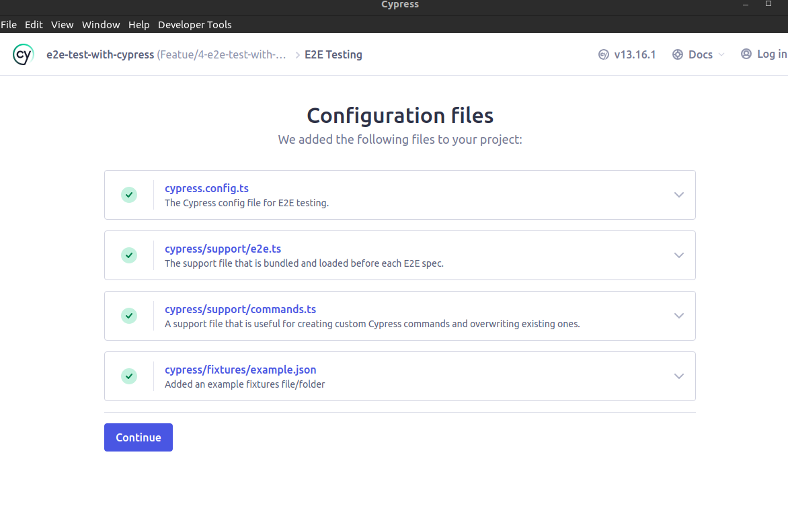

# Cypress experiment

## Use in devcontainer (ONLY RUN)

Linux dependencies are already added to the `Dockerfile`

## Installing 

Using a terminal **OUTSIDE THE CONTAINER** 

```bash
npm install cypress --save-dev
npx cypress install
npx cypress open
```





## Developement 

**OUTSIDE THE CONTAINER**

Open first terminal 
```bash
npm run dev
```

Open second terminal 
```bash
npm run cy:run
```

**OUTSIDE THE CONTAINER**

Accessing the UI
```bash
npx cypress open # or npm run cy:open
npx cypress open --e2e --browser firefox # or npm run cy:open:firefox
npx cypress run --browser firefox
```

Running on the command line 
```bash
npx cypress run --browser firefox
```

## usefull links

- [https://docs.cypress.io/app/get-started/install-cypress](https://docs.cypress.io/app/get-started/install-cypress)
- [https://github.com/cypress-io/cypress-example-kitchensink/tree/master](https://github.com/cypress-io/cypress-example-kitchensink/tree/master)