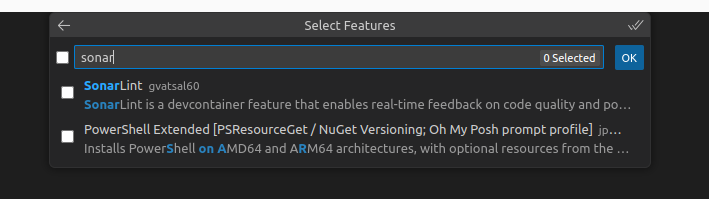
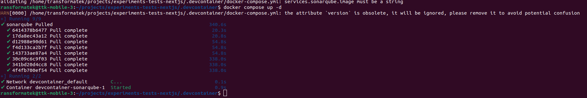
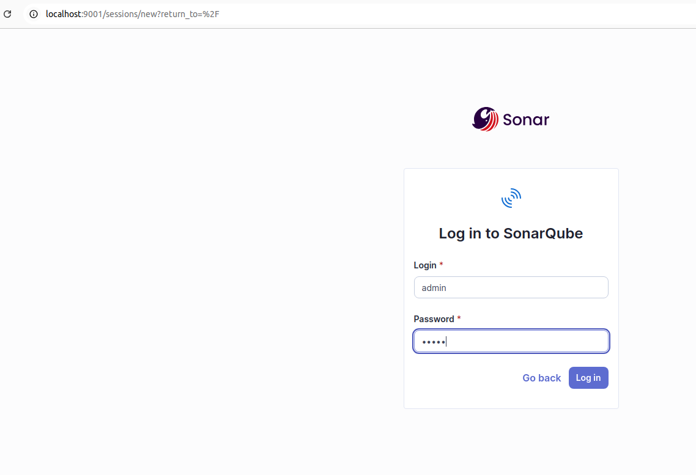
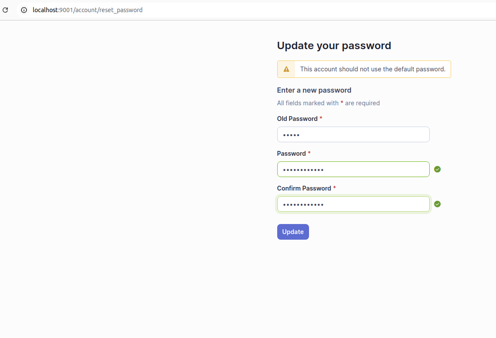
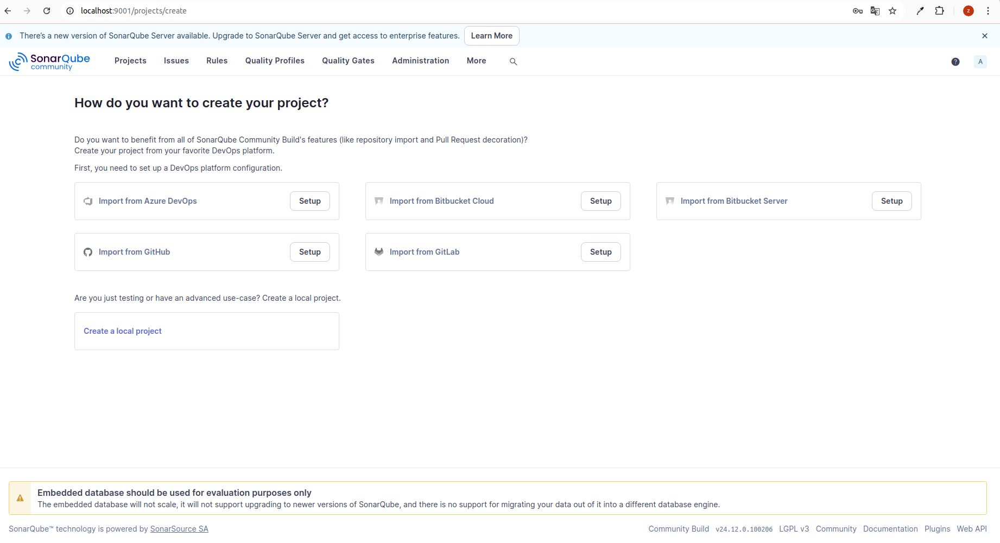
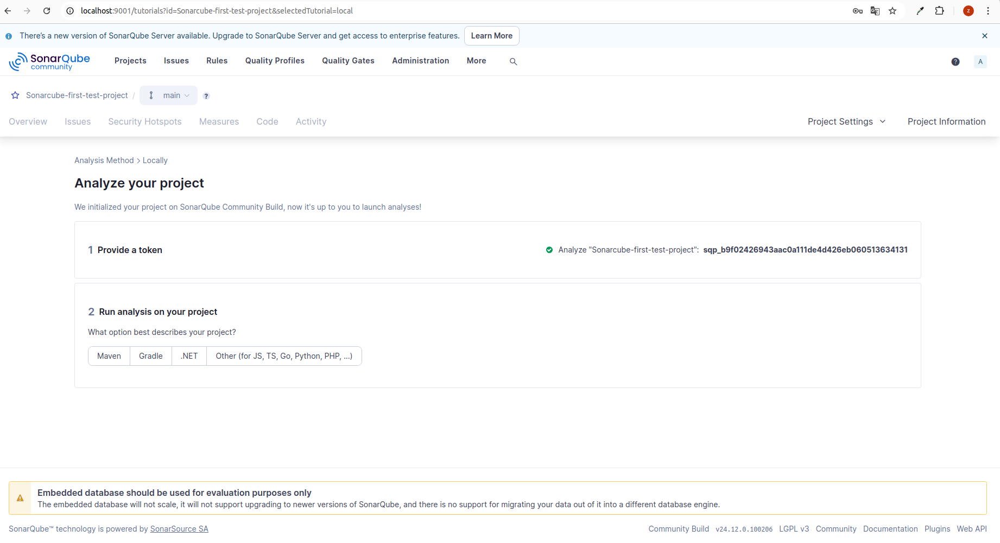
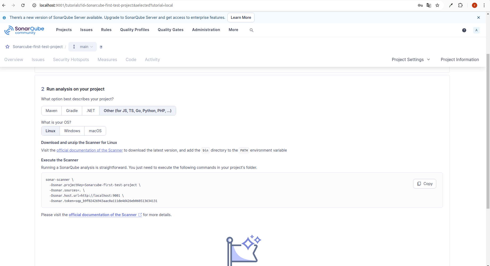
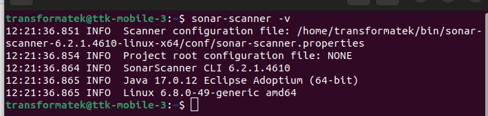

This is a [Next.js](https://nextjs.org) project bootstrapped with [`create-next-app`](https://nextjs.org/docs/app/api-reference/cli/create-next-app).

## Getting Started

First, run the development server:

```bash
npm run dev
# or
yarn dev
# or
pnpm dev
# or
bun dev
```

Open [http://localhost:3000](http://localhost:3000) with your browser to see the result.

## Getting Started with sonarcube

1- **Devcontainer setup**:

Reopen Your project in devcontainer and add `SonarLint` Feature:



This line will be auto-added into your devcontainer file

```
"features": {
		"ghcr.io/gvatsal60/dev-container-features/sonarlint:1": {}
	}
```

2- **sonarcube setup**

Create `docker-compose.yml` inside ./devcontainer folder and paste this code:

```
 version: “3”
services:
    sonarqube:
        image: "sonarqube:latest"
        ports:
            - "9001:9000"
        environment:
            - SONAR_ES_BOOTSTRAP_CHECKS_DISABLE=true

```

In your terminal RUN :

```
cd /path/to/your/project/docker-compose/file/location

docker compose up -d
```



3- **Accessing SonarQube on Localhost**

- Navigate to SonarQube: In the browser’s address bar, type `localhost:9001` and press Enter. This directs you to :



- The default login credentials for SonarQube are:

  - Username: admin
  - Password: admin

- Upon first login, you may be prompted to reset password:



- Now you should create a local project for your local project:

  - Click `Create a local project`



- Generate token



- Now we need to select an option that decribe our project:



3- **Setup Sonarcube-scanner for linux**

- Download sonarcobe-scanner by visiting this url
  [text](https://docs.sonarsource.com/sonarqube-community-build/analyzing-source-code/scanners/sonarscanner/)
  ,Download scanner for your os

- unzip downloaded file and place it in a commonly used location or in a directory dedicated to development tools.

- Add Sonar Scanner to System PATH:

  - for linux add it to `.bashrc` file

    `export PATH=$PATH:/path/to/directory/sonar-scanner-6.2.1.4610-linux-x64/bin`

- check scanner version:
  RUN

  ```
  sonar-scanner -v

  ```



3- **Link project and handle scan**

- in your project root create `sonar-project.properties`
  add this code

```
sonar.projectKey=Sonarcube-first-test-project
sonar.sources=.
sonar.host.url=http://localhost:9001
sonar.login=sqp_b9f02426943aac0a111de4d426eb060513634131
```

- In your terminal , navigate to your project and run scanner :

```
sonar-scanner
```

- you can check result in your sonarcube local server

# Useful links:

[quick-start-local-sonarqube-setup-with-docker-for-js-ts-project](https://medium.com/@s.klop/quick-start-local-sonarqube-setup-with-docker-for-js-ts-projects-2c1f19c24567)

[sonar-scanner-cli](https://hub.docker.com/r/sonarsource/sonar-scanner-cli)

[ci-integration](https://docs.sonarsource.com/sonarqube-server/latest/analyzing-source-code/ci-integration/overview/)
